# labGit
Este es un repositorio asociado al curso de Plaformas Abiertas (IE-0117, UCR)

## Pasos para generar este repositorio 

1. Creación del repositorio en GitHup

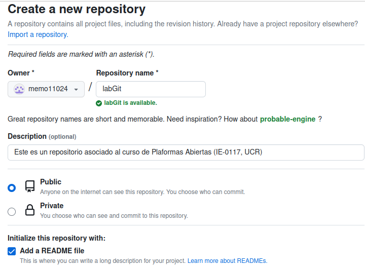

2. Clonar el repositorio remoto a uno local 

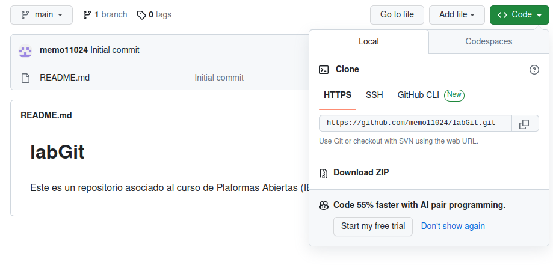

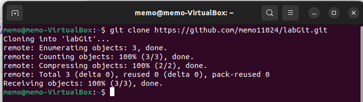

Nota: Se creó un token para asociar los repositorios local y remoto 

3. Modificación del archivo README.md

Se hicieron 5 commits para actualizar el archivo  

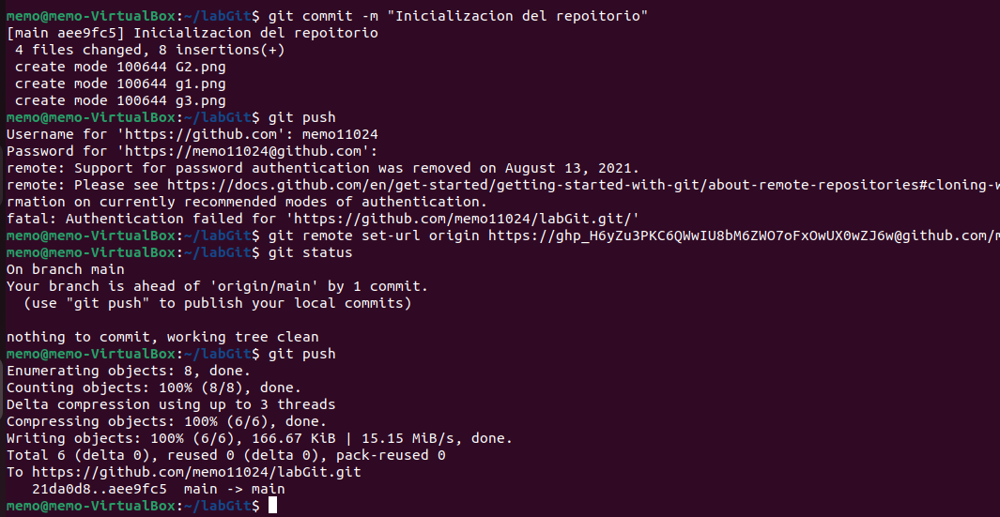

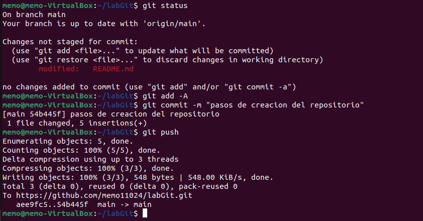

Los principales comandos utilizados fueron:

`git add -A`

`git commit -m`

`git push`

## Generación de la rama final de semestre   

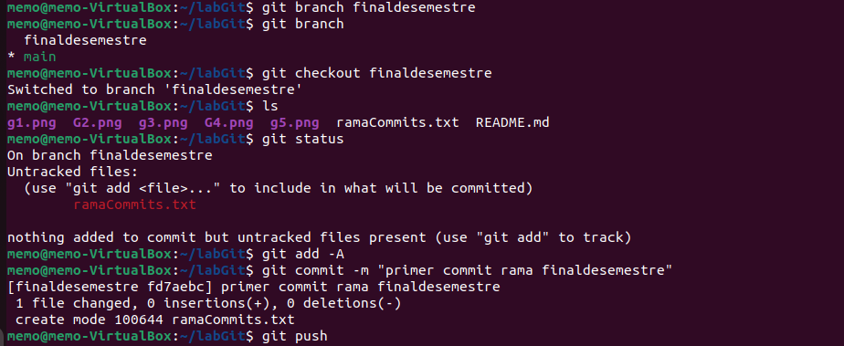

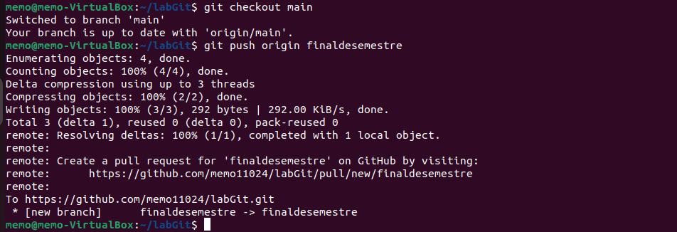

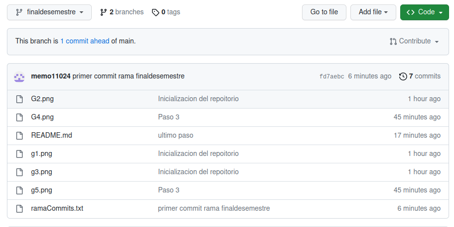

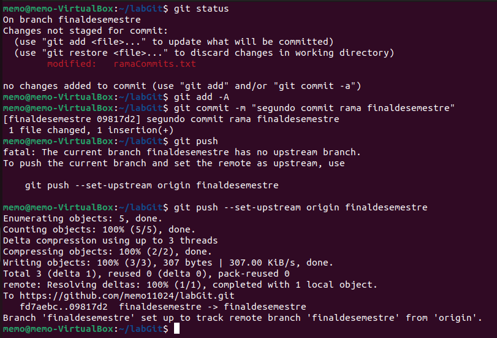

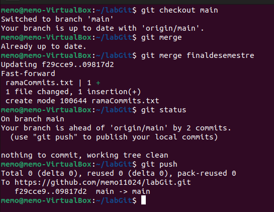

## Cambios para la ultima rama 
último cambio

## Prueba de pull

pull realizado despues de las solicitudes de extracción en GitHub

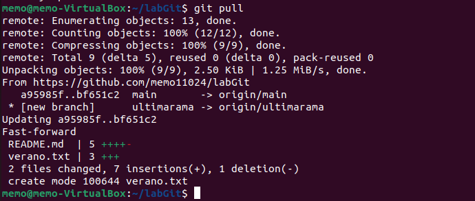

